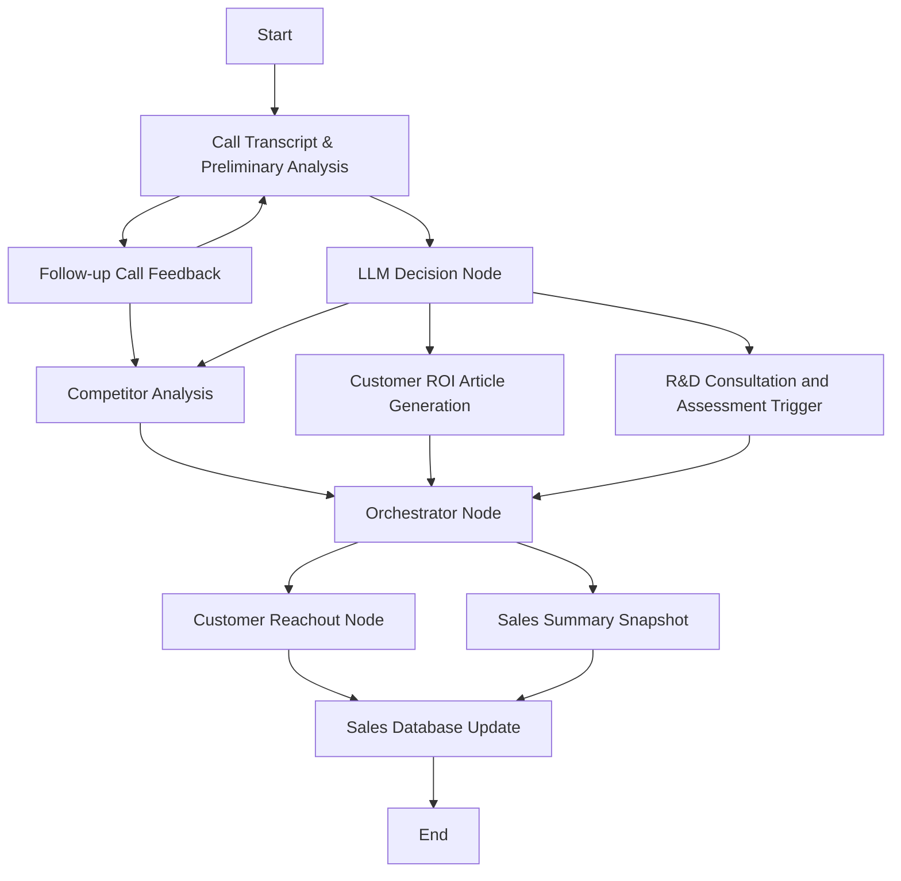

# B2B Sales AI Agent - SynapseSales Optimizer

An AI-powered B2B sales assistant that analyzes customer calls, extracts key insights, and automates follow-up actions to accelerate deal cycles.

## Features
- Call transcription and sentiment analysis
- Competitor mention detection
- Confidence level scoring
- Personalized content generation
- Intelligent workflow routing
- Automated stakeholder notifications

## Architecture
Built with LangGraph for robust workflow orchestration, combining:
- Speech-to-text processing
- LLM analysis pipelines
- Email automation subsystems
- Knowledge retrieval systems

## System Flow

## Business Value Proposition
This system will:

- Reduce sales follow-up time by 60-80%
- Increase competitive win rates through timely responses
- Improve deal consistency with standardized processes
- Enhance customer experience with hyper-personalized content
- Provide management with real-time deal insights

## Getting Started
- [Installation instructions]
- [Configuration guide]
